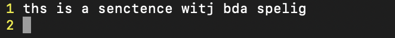
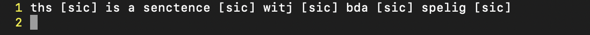

# Spell Checker
## How to run:
- Can edit dictionary with your own words(currently contain 1000 most common words): Words must be tab seperated
- Can edit sampleInput with your words or sentences

### In command line run :
- make clean
- make test 
## Check file 'yourOutput' for the word that that are spelled wrong in your sentence

