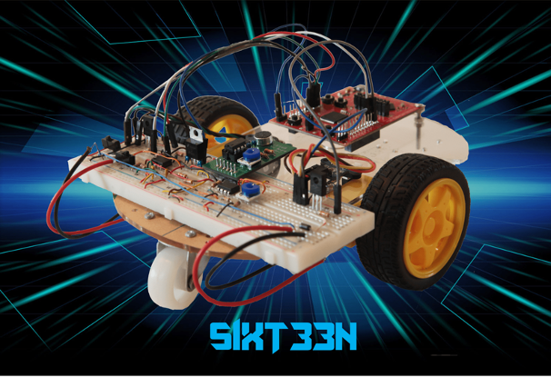
1.	Prologue

Building a voice-controlled car was the most fun and exciting part of 16B. While we spent many hours debugging, testing, and re-evaluating many aspects of the project, we truly enjoyed getting our hands dirty and building something incredible. In the section to come, you will find our thought process and implementation of the SIXT33N voice controlled car. While working remotely had its disadvantages, primarily building two separate cars and trying to cross-reference them, the largest by far was the MSP430 board. Both of us managed to fry our board to some extent, although we were being extremely careful with every pin and plug. Unfortunately, there are some aspects that we cannot control, and the MSP430 board fell in that category. After understanding the fundamentals which we go through in the sections below, we realized that it is possible to expand our model to any board that gives us PWM pins, and so we settled for a Raspberry Pi 4. While we did not have enough time to prepare for the final and complete this side project, it is something both of us are going to pursue after we are done with the finals and have more spare time. Throughout the course labs taught us extremely useful skills, it’s one thing to know it in theory, another to implement it. So many issues arise that the theory would not anticipate, but as Berkeley engineers, we must be ready for everything!

## 2.	The Circuit
Transfer function:
 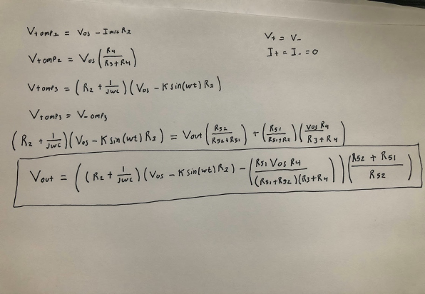

Actual mic frequency response:
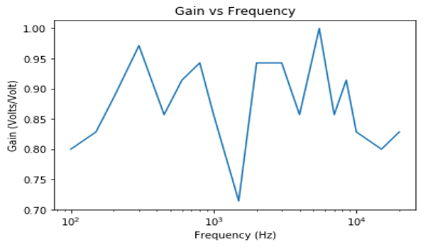

 
In general, the performance of the micboard worked as expected and was able to respond to certain frequencies accordingly. However, the mic deviated from our expectation when we wanted to record higher frequencies. This is due to a limitation in the design of the microphone and for practical purposes the microphone does not need to be able to record higher frequencies. In general, it was better at listening to lower frequencies due human speech not being much higher than 1kHz. This physical limitation of the microphone affects the transfer function by changing the way we view the transfer function of the microphone. The mic board can be modeled with a more accurate model that involves an impedance or impedances of the microphone.  This, however, does not necessarily mean that the model will affect our data collection due to the fact that it performs well in frequencies of normal speech. When we recorded our data we recorded the words “Freud”, “epilogue”,” kingdom” and “unimportant”. The most important characteristic for characterizing words said by different people are the number of syllables used in a word.  This is most likely due to the mic board being more sensitive to lower frequencies such as when one person is finishing a syllable.
Operations:

The goal of the mic board is to maximize volt amplitude between0 V and 3.3 V while also reducing setting the DC offset to 1.65 V. The microphone can be modeled as a signal-dependent current source, IMIC = k sin(ωt), where IMIC is the current, k to current conversion ratio, and ω is the signal’s frequency. There is a voltage buffer after the mic board in order to prevent loading. C1 is used to eliminate any DC voltage coming from the first stage and therefore there are only AC signals being passed to the next stage of the mic board circuit. Lastly, we used a gain amplifier to amplify the signal to the desired amplitude. 

# 3.	Schematic
The diagram above is the first part of circuit schematic. It includes the 5V voltage regulator, which is used to power buffers/op-amps as well as the mic-board. We have each pin of the mic-board connected to its allocated lot, as such OS1 and OS2 are connected to the biasing circuit, and we also have the V_out connected to a buffer which has a low-pass filter connected to it as well. Right after the low-pass filter we have our final component, which is the “non-inverting” amplifier. This part was primarily used in part 1 of the lab to regulate how much voltage went to the wheels, and is controlled by the potentiometer (a.k.a. Voltage divider).  For all buffers that do not have a V_DD shown, it is 5V by default, and those that do are specified on top. 
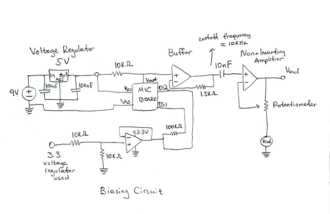

The diagram above is the second part of circuit schematics. Here we can see the motors and the encoders connected to the launchpad. Best effort was made to show that motors are connected to PWM pins and encoders to reading pins. Notice that in this diagram we have also included the 3.3V voltage regulator, this is because encoders feed from it directly. As an improvement we can introduce voltage regulators instead of attaching encoder wires to the launchpad pins immediately to avoid frying the MSP430. Motors are put opposite of each other because we want them to drive in “opposite directions”, so when put in the wheels parallel our car would go straight instead of going in a tight circle.  
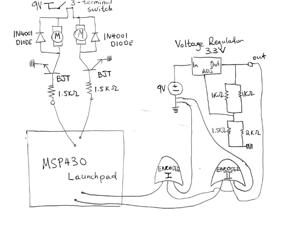

 
# 4.	Control

Each wheels has mechanical differences, and for this reason we use two linear models for wheels velocity measured in the following formulas:

 
 

Here   and   differentiate Right and Left motors of our SIXT33N car.   shows the distance travelled at time k. We are modelling our wheels linearly, thus   and   give us the slope and the y-intercept accordingly. 

First, we realize that in the closed-loop system, we are controlling the velocity of the car by supplying feedback from itself. So, for this to work, our control has to be of the form   where the first part is our open-loop control for some desired velocity   and the second part is the state feedback where we defined   as our state variables. More precisely we would have the following for each wheels:

 
 

The reason we subtract in the first equation and add in the second is because we want to reach  , if we were always subtracting we would eventually drive our motors to rest. With this we always balance off for the lack of speed in one wheel by slowing down the other and vice versa.

After setting   and simplifying we get  . We notice that the coefficient describes our state variable in time, and thus is our eigenvalue. In theory, choosing any   and   such that   is less than 1 would satisfy our stability condition, as over time our state variable would go to 0.

Initially we choose   and  . This in theory would yield the desired result. However, what we observed was that this is not necessarily the case, the reason is that we only estimate our eigenvalue and in reality it is not always that accurate. Also, choosing    and   meant that our system would oscillate, which too is not desired. For these reasons we settled for better k-values:   and  . This guaranteed that system mismatch would not be a problem, and also removed the oscillation part. 

In practice we experimented with a handful of k-value pairs. Turns out that oscillation is not good for our system at all, because while it does result in a steady state in a long-run the car often gyrates, and this is certainly not a desirable outcome. Eventually we settled for a positive eigenvalue of   by choosing k-values as specified above. 

To allow the car to turn we realize that we only need to make one wheel turn faster than the other. This can be achieved by altering our state variable  . For a smooth transition we came up with the following solution: 

Drive Right
 

Drive Left
 

We notice that the equation (1) and (2) of driving right/left are very similar. In fact, these are just the negation of each other, which intuitively fits well since a turn right is a negative turn left and vice versa. For the car to go straight, we would simply change our state variable to be 0. This way the difference between the distance traveled for each wheel would hence be 0.

In the plot we have two identical k’s with value 0.1. This means that the eigenvalue is 0.8 < 1, thus it would reach a steady state. If we were to plot this, we would obtain something like this:

So, our SIXT33N would have some initial tilt, but as it reaches a steady state, it’s state variable delta approaches 0 and the car starts moving straight.

  is meant to give us a better model of our state variable: meaning it should help us straighten our car better. This   accounts for model mismatch, which if we write in an equation form looks like this:

 

And,

 

As k goes to   we will notice that model mismatch predominates, and to account for this we introduce  . Obviously, STRAIGHT.CORRECTION is very different from this, since it is implemented when the car “thinks” it is going straight, so we tilt it slightly so that it goes “straight” for us.

# 5.	SVD/PCA

In this lab we used envelope-based PCA. This is a good choice because it allows us to have an effective yet simple dimensional reduction representation of our data. The initial steps of the implementation of the PCA was aligning and stacking the data. We performed these tasks because our implementation of the PCA does not do very well with delay of and variation of recording. We used the variable  PRELENGTH, which is the number of steps to include before our speech command THRESHOLD is used to determine where our speech command starts, which  is a  function of the relative maximum amplitude of that words recordings and the parameter THRESHOLD(a value between [0,1]. These variables affect the given alignment by viewing different variations in recording as “important” aspects of a given recording. These variations before and during the recordings could lead to misalignment. We then stacked our data and demeaned the data. We demean our data in order to help standardize our data and eventually give better directionality to our principal components . 
The SVD is written as  . :  The   and   are a set of orthonormal bases, and where   is a matrix of our principle components. Σ is a diagonal matrix where the diagonals are the sqrt(λ) and can be viewed as the “magnitude of the singular values.  We used three singular values for our classification. We did this because the first three principal components had the greatest significance or magnitude. Once we found the most important principle components. We formed a basis with the three principal component vectors. We then projected our data into this basis in order to see how our words differed from each other in this lower dimension. Our classifier would get a new recording project to this basis and find the closest word to this projection. We tuned the classification with variable CLASSIFICATION THRESHOLD and LOUDNESS THRESHOLD. CLASSIFICATION THRESHOLD was used to determine how far a word needed to be from the clusters to be classified as that word. We unfortunately were not able to test our classifier outside of this lab section due to the aforementioned malfunctioning hardware. However, if we had tested the classifier on the car.  Hypothetically, despite classifying 100% of the time in the lab, the classifier may have been dealing with more variation in our speech and environmental factors when in the car and may not have handled all of our classifications requests or may have misclassified . 

# 6.	Integration

The project was incredible, it was building something we considered really cool while learning a lot in the process. Lectures taught us about concepts and the labs enabled us to implement them. What was particularly important both about the project and the other labs was dealing with all erroneous problems that came from either the circuit or the launchpad. We learned more from debugging than from constructing, and we believe this is the best part of the labs. Having everything working fine on the first try is bad, actually is horrible, because later, when something does go wrong you would have no idea how to solve it because the problem has become so large that it is extremely tough to pinpoint where the issue is coming from. We spent many hours debugging and understanding how each part of the project worked, and while we sincerely hated those hours, we later realized that it was for the best.. Overall, we are thrilled to have completed this project, it taught us a skillset that we will carry on for a long time. The structure of the project is well organized, the only limitation are the launchpads. 

<h1> Two Voltage-Clamp for Expression of Channels in Oocyte </h1>
<h2> Introduction: </h2>
Through the lab two voltage clamp recording was used to monitor and record the ion channel expressed in oocyte. We looked at ion channels that had voltage dependence and ion channels that are ligand gated. This is done  in order to monitor the relative activities at different holding potentials and at different voltage steps. We further chose to voltage-clamp the oocyte because they are relatively easy to voltage clamp due to their large size. Additionally, oocytes are relatively voltage silent due to the limited channels natively expressed in the oocyte. The expression of the channels was done by injecting c-RNA into the cell and allowing the cell to express the channels in its membrane.
The channels that we expressed in the oocyte to monitor voltage dependence were ShB𐊅6-46, DRK, ShB. ShB natively has C-type inactivation and N-type inactivation. For the ShB𐊅6-46 the ShB was genetically modified inorder for there to be only C-type inactivation. DRK, like the ShB𐊅6-46, only has C-type inactivation. We looked at time constants for holding potential and voltage steps. We additionally looked at inactivation of some channels. 
 For ligand dependence the two channels that we expressed in P2xR1 and TASK2. P2xR1 is a non selective ionotropic channel. The TASK2 channel is a pH dependent K+ channel. For each we looked at the I-V curve and the G-V curve. For P2xR1 we additionally looked at the if the cell desensitized to ATP and looked at the rate at which this occurs.
Results/Discussion of results:
A.Passive Properties of membrane:

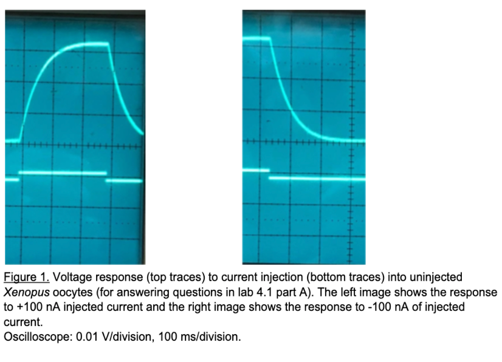

 
The time constant = "60ms" is and was found by taking .63% of the max voltage.V=IR
Voltage at 60ms ≈ .02V 
I = 100nA (the applied current)
Therefore  .02V/100nA  = 2*(10^-4)Ohms
Tau is so long due the cell being much larger compared to a neuron.  This would make the resistance large and therefore the time constant larger. The time constant does not change depending on whether the current injection was depolarizing or hyperpolarizing. The graph indicates that the channel is not dependent on the other factors. 

<h3> B) Voltage-clamp uninjected oocytes: </h3>
Figure 2: 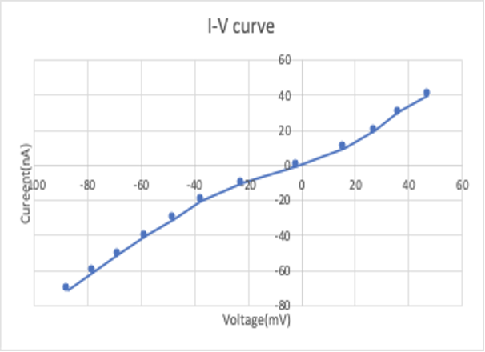
This is the I-V curve for the uninjected oocyte.  
The current is caused by native channels that are already present in the oocyte. The curve  is due to the oocyte having primitive ion channels that are not dependent by voltage or other substrates. However, the resistance on the probe is not infinite and causes the 

    

#### C.Voltage dependence of channel opening: 

Figure 2:
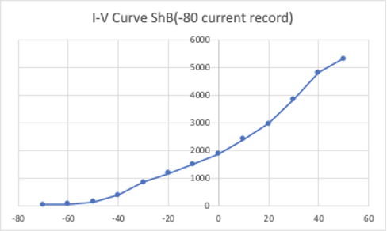	
Figure 3:
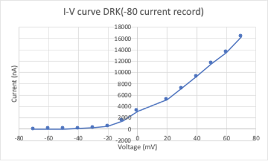

     
In figure 2, the graph for the I-V curve of  DRK channel, and in figure 3, the graph for the I-V curve of ShB𐊅6-46, show that the two channels are voltage dependent. This explains the non-linear relationship between voltage and current. The ShB𐊅6-46 channel, however, still remains somewhat voltage dependent even after the change in the c-RNA from the native ShB. This voltage dependence for there still being C-type inactivation of the ShB𐊅6-46.

Figure 4:
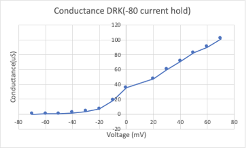 
Figure 5:
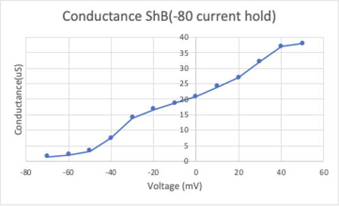
  
In figure 3, the graph for the G-V curve of  DRK channel, and in figure 4, the graph for the G-V curve of ShB𐊅6-46, show that the two channels’ conductance changes on linearly with voltage.  The DRK channel is more voltage dependent and begins to transport more cation at around -10mv. Additionally, the graph of conductance for ShB𐊅6-46 shows that it is not very voltage dependent. The channel’s conductance seems to be very linear with respect to voltage 

Figure 6:

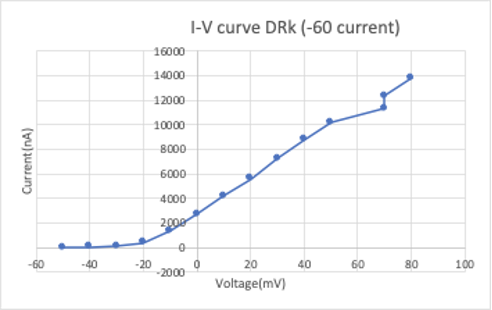 

Figure 7:

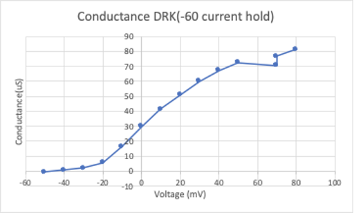

  
Figure 6 and figure 7 show the I-V curve and the G-V curve of the ShB𐊅6-46 channels respectively at -60mV holding potential. Comparing the I-V curve of the two holding potential, figure 6 and figure 2, one can observe that there is a great rate of change of the oocyte held at -60 mv versus -80mv. This is due the cell already moving more cation across the membrane when the step is taken from holding the membrane at -60m. Although the recording was effective and captures voltage dependence of the channel, previous recordings were done(which held the membrane potential at -40mv) and from our recording the results differ by about 5pA (Speake et al. 2004).
We also found the reversal potential to be about -50mV this is in agreement with other recordings (Speake et al. 2004).

### D. Slow C-type inactivation:
Figure 8:

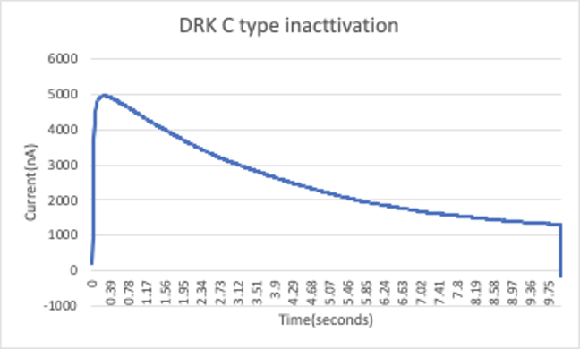
  
Figure 10 shows the DRK C-Type inactivation. From the data the time constant was calculated to be 4.12 second.  				

Figure 9:

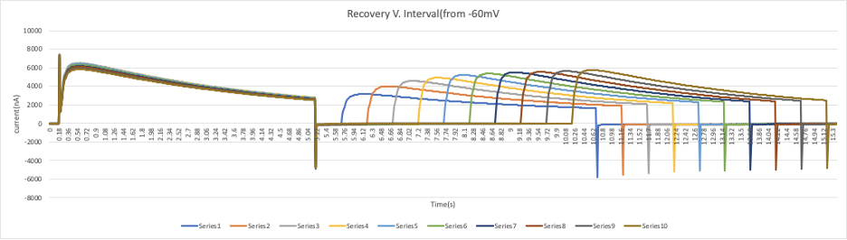

Figure 10:

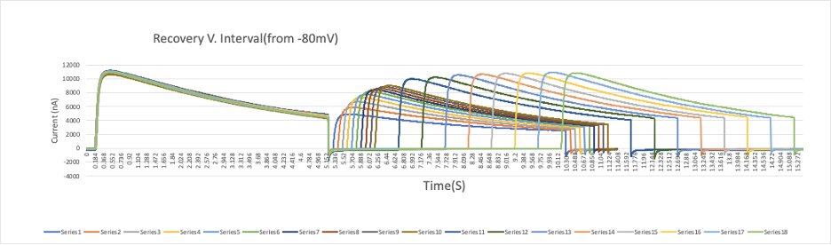
 

## Time constants for figure 10:
Series 1: 2.02secs     	Series 11: 3.12 sec
Series 2: 2.96 secs    	Series 12: 2.6088 sec
Series 3: 3.264 secs 	Series 13: 3.45 sec
Series 4: 3.16 secs    	Series 14: 3.33 sec 
Series 5: 2.756 secs 	Series 15: 3.34 sec
Series 6: 2.944 secs 	Series 16: 3.24 sec
Series 7: 2.96 secs   	Series 17: 3.21 sec
Series 8: 2.76 secs   	Series 18:  3.23 sec
Series 9: 3.12 secs 
Series 10: 3.12 secs
## Time constants for figure 11:
Series 1: 2.054 secs 	Series 2: 2.154 sec 
Series 3: 1.9 secs 	Series 4: 2.054 sec 
Series 5: 2.234 secs 	Series 6: 3.152 sec  
Series 7: 3.0 secs	Series 8: 2.54 sec  
Series 9: 2.054 secs	Series 10: 2.02 sec 
The time constant is different for -80mv versus -60mv due to hyperpolarization causing more channels to become active. For -60mV there is a greater probability for channels to be in their inactive state. For the more negative hold, the negative potential “attracts” the “protein plug ” to be more favorable in an active state, unblocking the channel

E. Fast N-type inactivation in ShB

Figure 11:

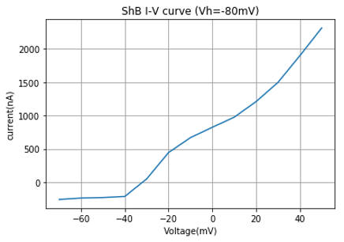

Figure 12:

  
In figure 12 and figure 13 the I-V curve and the G-V curve of ShB is plotted respectively. Comparing the I-V curve of ShB versus the I-V curve of ShB𐊅6-46. The native ShB I-V is much more non-linear. This is due to the fact that in ShB𐊅6-46 the voltage dependence was removed. Additionally, the conductance of ShB𐊅6-46  appears greater than that of ShB. This can also be explained by the fact that the ShB𐊅6-46 channel has C-type activation present whereas ShB is inactivating more quickly.  

Figure 13:

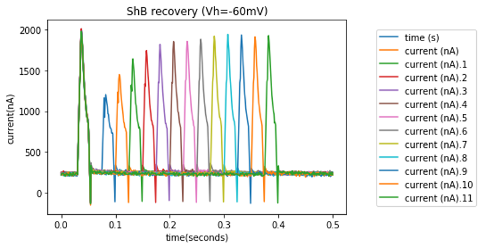
	 

Figure 14 shows the N-type activation of ShB at the holding potential of -60mV. Figure 14 shows the N-type activation of ShB at the holding potential of -80mV.  The time constant of N-type activation is ≈ .015 seconds. This was calculated by taking .63 of the current to decay and finding the time. Compared the C-type inactivation the N-type inactivation is ≈ x200 greater. For the sake of clarity, the capacitive current was removed from the data. However, some capacitive currents remained. This can be seen in the second trace of “current” in figure 17. It is the maximum of “current”.

 Figure 14:
 
 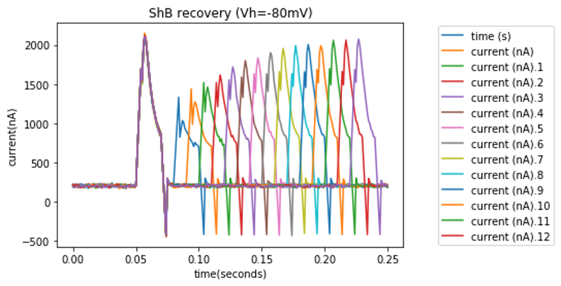

  
Recovery of ShB at membrane potential took about .15 second. Recovery of ShB at membrane potential took about .2 second. 
G. Leak-type K + channel
Figure 15:

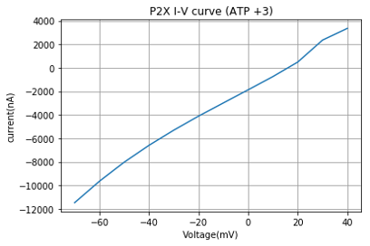

Figure 16:

Figure 17:

Figure 18: 

Figure 19:

Figure 20:

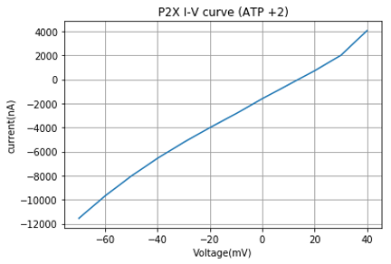

Figure 21:

	

Figure 22: 

Figure 23:
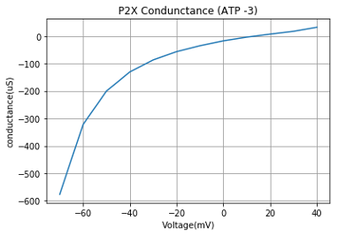

Figure 24:

Figure 25:
	

Figure 26:
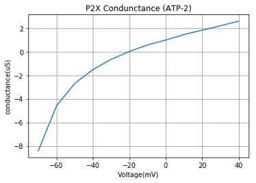

Figure 27:
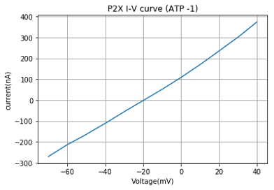
Figure 28:
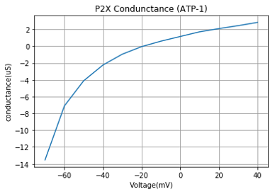

From the data collected, when ATP is present is Erev approximately 18mv. Additionally, Ecl is equal to -64mV. 
From this, it is clear that the P2xR1 current dominates. This is shown by the Erev being very distant from Ecl. From further recordings, we found that P2xR1 does desensitize.  We calculated that the time constant is 1.25 seconds

F. Ligand-gated ATP channel
Figure29:

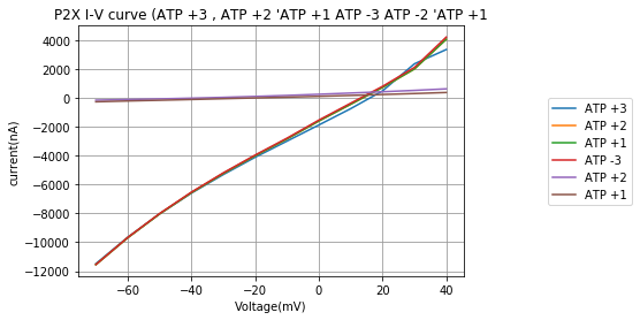

Figure30:

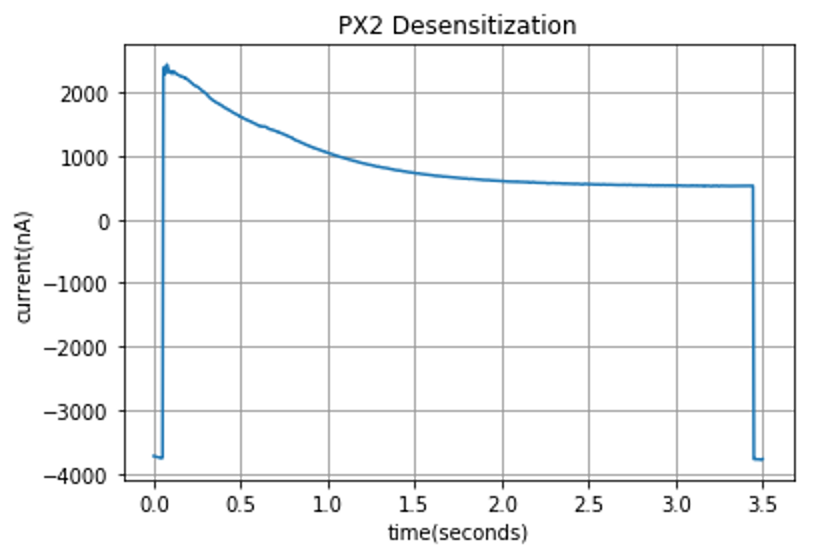

Figure31:!

Figure32:

Figure33:

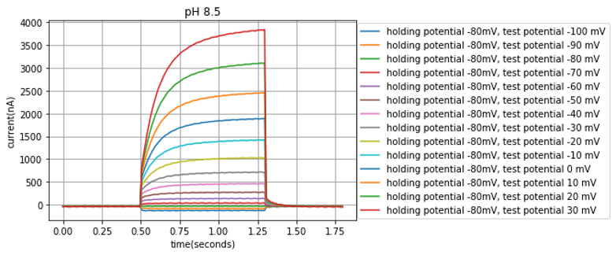

Figure34:

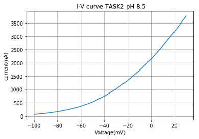
  
From the data collected, we observed that the TASK2 channel functions best at a pH of 8.5. The following figure shows for a pH of 8.5 the reversal potential was not calculated due to there being the best activity. However, for pH of 8.5 and pH of 7.5 the reversal potential was calculated to be around -70mV. The relative activity at 0mv was that at pH of 8.5 the cell had a current of 2100nA, at a pH of 7.5 the cell had a current of 780nA, and at a pH of 6.5 the cell had a current of 780nA. However, the data collected differs from previous recordings done by other labs. The channel has been seen to show much greater sensitivity to pH changes and our pH of 6.5 differs from previous recording (Cid et al., 2008). Despite this, the sensitivity to pH can still be seen. This helps to show that during hypoventilation the cell will fire more rapidly as a result the blood being more basic and the channel allowing in more cations. During hyperventilation the cell will fire slowly rapidly as a result the blood being more acidic and the channel allowing less cations into the cell. Despite this specific function of TASK-2 studied, TASK-2 expression has been reported in a variety of cells and tissues ranging from kidney to immune cells and including specific neurons, with all varying functionality (Cid et al., 2008).    

Conclusion:  
The main fiding for ShB𐊅6-46 was that the N-type inactivation was completely eliminated from the channel, yet it maintained its C-type inactivation. ShB𐊅6-46 compared DRK provides a weaker current and has a smaller conductance. Additionally, DRK has a time constant of about 2.7- 3.4secs. This was found to be about 200 times slower than that of ShB’s time constant (the time constant of N-type). When ShB was compared to ShB𐊅6-46, similar result we found, and we concluded that the time constant was about 200 times fast in ShB N-type inactivation than ShB𐊅6-46 C-type inactivation. For ShB’s N-type recovery (holding at -60.mv membrane potential) took about .15 second to. For ShB’s N-type recovery(holding at -80.mv membrane potential ) took about .2 second. For P2xR1, we looked at the activation of ATP present and found similar results each time ATP was present. The resistance of the P2xR1 was significantly reduced when ATP was not present. For the TASK2 channel we found that the ion channel function best at 8.5 pH when compared to 7.5pH and 6.5pH.
	The TASK2 channel is the most interesting. I feel in a future lab we could look at further upstream neurons from the TASK2 and look at the circuit that this neuron is a part of. 
The hardest part was looking at the statistical significance of some of the data. 
Using the same set-up of expressing the channels in an oocyte and using two voltage clamp recordings we could look at other TASK channels and compare the properties of each one more in depth. 

Reference List:

Cid LP, Roa-Rojas HA, Niemeyer MI, González W, Araki M, Araki K, Sepúlveda FV.(2013). TASK-2: a K2P K(+) channel with complex regulation and diverse physiological functions. Frontiers in physiology 4-198.8.

Tracey Speake, Jonathan D. Kibble, Peter D. Brown.(2004).Kv1.1 and Kv1.3 channels contribute to the delayed-rectifying K+ conductance in rat choroid plexus epithelial cellsAm J Phys 286:C611–C620

